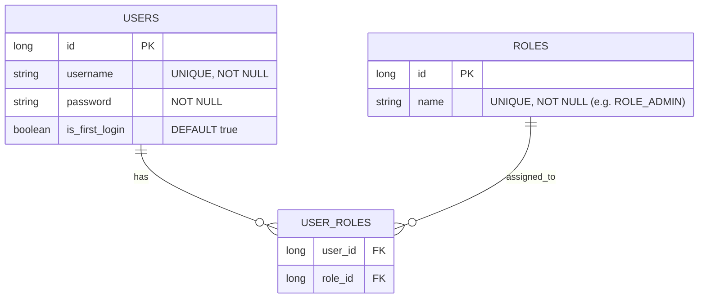
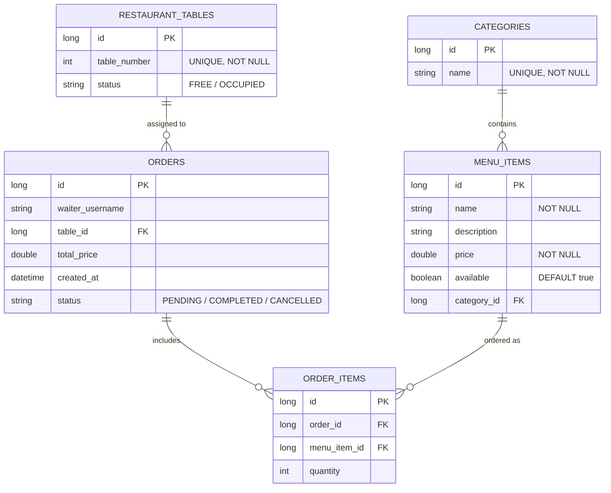

# Restaurant Management System (RMS) - Microservices

A professional, high-performance backend system for managing restaurant operations, built with **Spring Boot 3**, **PostgreSQL**, and a microservices architecture.

## 🏛️ Architecture Overview

- **Identity Service (Port 8081):** Centralized Auth provider. Manages users, credentials, and JWT generation.
- **Restaurant Service (Port 8082):** Core business engine handling the menu, inventory, and order lifecycle.
- **Common Library:** Shared logic for JWT validation and security filters to ensure consistency.

## 🚀 Key Technical Features

- **Method-Level Security:** Every sensitive endpoint is protected by `@PreAuthorize` based on roles.
- **Transactional Integrity:** Orders and status changes use `@Transactional` to ensure a "all-or-nothing" execution.
- **Global Exception Handling:** Unified error responses for better frontend integration.
- **Soft Deletion & Status Management:** Orders are tracked through `PENDING`, `COMPLETED`, and `CANCELLED` states.

---

## 📖 API Documentation

Detailed API documentation, including request examples, headers, and expected responses, can be found here:

👉 **[Postman Public Documentation](https://documenter.getpostman.com/view/13473219/2sBXwntCWC)**
Postman collection is available in /postman folder. Import it to test the API locally.

---

### 🗄️ Database Schema

#### 🔐 Identity Service (`auth_db`)

The Identity service manages user authentication and authorization using a relational Many-to-Many model.



#### 🍴 Restaurant Service (`restaurant_db`)

The Restaurant service manages the core business data, tracking the relationship between the menu, physical tables, and customer orders.



---

## 🔌 API Reference

### 🔐 Identity & Auth Service (`/api/auth`)

| Endpoint           | Method | Access        | Description                   |
| :----------------- | :----- | :------------ | :---------------------------- |
| `/health`          | `GET`  | Public        | Check service status          |
| `/register`        | `POST` | **Admin**     | Register a new user           |
| `/login`           | `POST` | Public        | Returns JWT and user details  |
| `/change-password` | `POST` | Authenticated | Updates current user password |

### 🍴 Menu Management (`/api/menu`)

| Endpoint                   | Method   | Access    | Description                   |
| :------------------------- | :------- | :-------- | :---------------------------- |
| `/categories`              | `GET`    | Public    | Get all food categories       |
| `/items`                   | `GET`    | Public    | Get full menu                 |
| `/items/category/{id}`     | `GET`    | Public    | Filter menu by category       |
| `/categories`              | `POST`   | **Admin** | Create new category           |
| `/categories/{id}`         | `DELETE` | **Admin** | Remove category               |
| `/items/{categoryId}`      | `POST`   | **Admin** | Add item to specific category |
| `/items/{id}/availability` | `PATCH`  | **Admin** | Toggle item (In/Out of stock) |
| `/items/{id}`              | `DELETE` | **Admin** | Remove item from menu         |

### 📝 Order Lifecycle (`/api/orders`)

| Endpoint         | Method  | Access        | Description                                    |
| :--------------- | :------ | :------------ | :--------------------------------------------- |
| `/`              | `POST`  | Authenticated | Create new order (Auto-sets Table to OCCUPIED) |
| `/pending`       | `GET`   | Authenticated | View all active/pending orders                 |
| `/{id}/complete` | `PATCH` | Authenticated | Mark order as finished (Auto-frees Table)      |
| `/{id}/cancel`   | `PATCH` | Authenticated | Cancel order (Auto-frees Table)                |

---

## 🐳 Infrastructure & Docker

The system uses **Docker Compose** to manage isolated PostgreSQL instances for each microservice, ensuring environment consistency and easy setup.

### Run Infrastructure

To start the databases, run:

```bash
docker-compose up -d
```
